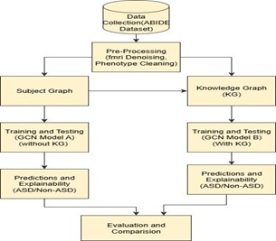

# Early Autism Spectrum Disorder Prediction  
## via Knowledge Graphs and Graph Convolution Networks  

# 📌 ABSTRACT

Autism Spectrum Disorder (ASD) is a neurodevelopmental condition affecting social interaction, communication, and cognitive behavior. Early detection is crucial for timely intervention and improved developmental outcomes.

This project presents a hybrid computational framework that integrates:

- Resting-State fMRI Brain Connectivity Graphs  
- Knowledge Graphs (KGs)  
- Graph Convolutional Networks (GCNs)  
- Explainable Artificial Intelligence  

Each subject’s brain is modeled as a graph of Region of Interests (ROIs) capturing second-order functional connectivity. A Knowledge Graph integrates neuroimaging data with phenotypic features such as age and sex to enhance relational learning.

The proposed system is evaluated on the ABIDE dataset and achieves:

✔ **84% classification accuracy**  
✔ Improved interpretability  
✔ Identification of key brain regions influencing ASD  

This framework improves both predictive performance and transparency in AI-based medical diagnosis.

---

# 1️⃣ INTRODUCTION

Autism Spectrum Disorder (ASD) is a complex neurological developmental condition characterized by:

- Impaired social interaction  
- Communication difficulties  
- Repetitive behaviors  

Traditional diagnostic approaches rely on:

- Behavioral observation  
- Clinical rating scales  
- Expert evaluation  

These methods are:

- Time-consuming  
- Subjective  
- Not scalable  

Recent advances in Artificial Intelligence and Deep Learning provide automated solutions. However, most existing systems:

- Do not model relational brain interactions effectively  
- Ignore integration of phenotypic attributes  
- Lack interpretability  

This project introduces a Knowledge Graph + Graph Convolutional Network hybrid framework to overcome these limitations.

---

# 2️⃣ PROBLEM STATEMENT

Conventional ASD diagnosis methods are subjective and fail to capture complex brain connectivity patterns and relational knowledge between imaging and phenotypic data.

There is a need for:

- A scalable and automated detection system  
- Integration of multi-modal data  
- High predictive accuracy  
- Transparent and interpretable AI  

This project addresses these challenges using graph-based deep learning.

---

# 3️⃣ OBJECTIVES

• Represent functional brain connectivity as graphs  
• Integrate neuroimaging and phenotypic features  
• Compare models with and without Knowledge Graph  
• Improve prediction accuracy  
• Provide explainability using GNN Explainer  
• Develop a modular and scalable system  

---

# 4️⃣ DATASET

Dataset Used: **ABIDE (Autism Brain Imaging Data Exchange)**  

Includes:
- Resting-state fMRI scans  
- Age  
- Sex  
- IQ  
- Diagnosis (ASD / Control)  

Brain Atlas Used:
- AAL Atlas for ROI extraction  

---

# 5️⃣ PROPOSED METHODOLOGY

The system consists of six major modules:

1️⃣ Data Collection (ABIDE Dataset)  
2️⃣ Preprocessing  
   - fMRI Denoising  
   - ROI Extraction  
   - Functional Connectivity Matrix  
   - Phenotypic Feature Cleaning  
3️⃣ Graph Construction  
   - Subject Graph (ROI connectivity)  
   - Knowledge Graph (subject similarity & attributes)  
4️⃣ Model Training  
5️⃣ Prediction & Explainability  
6️⃣ Evaluation & Comparison  

---

# 6️⃣ SYSTEM ARCHITECTURE

